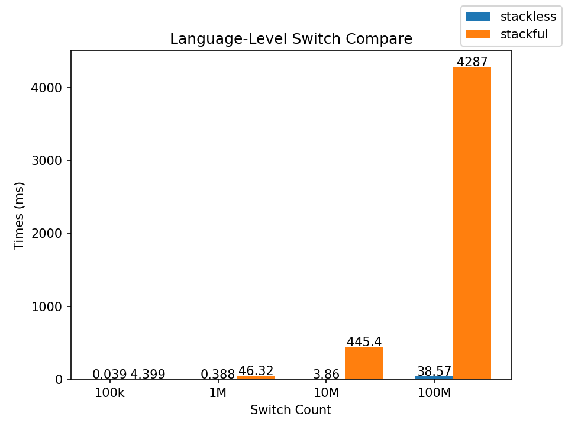
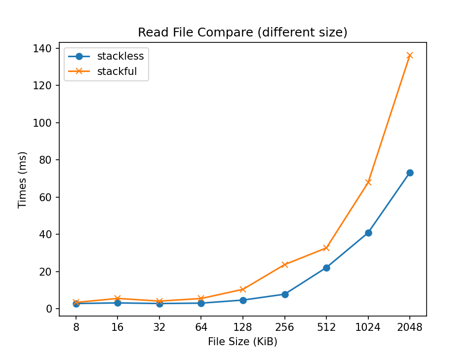
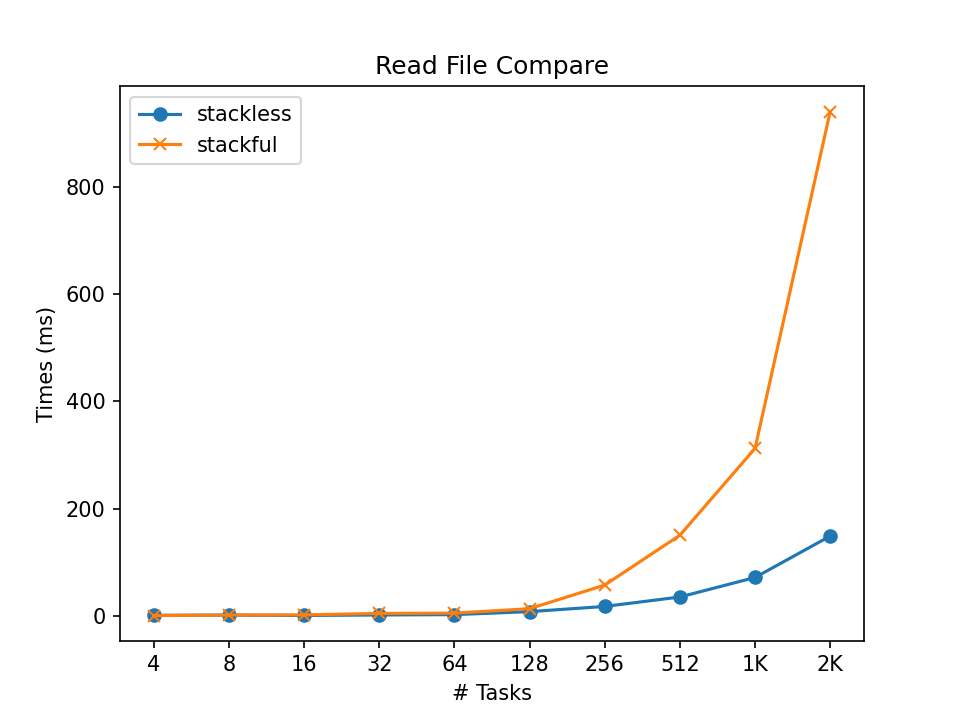
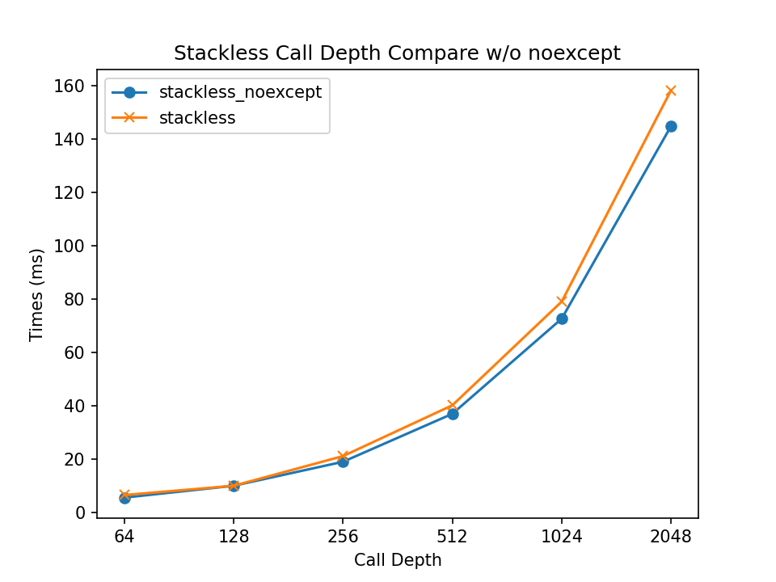
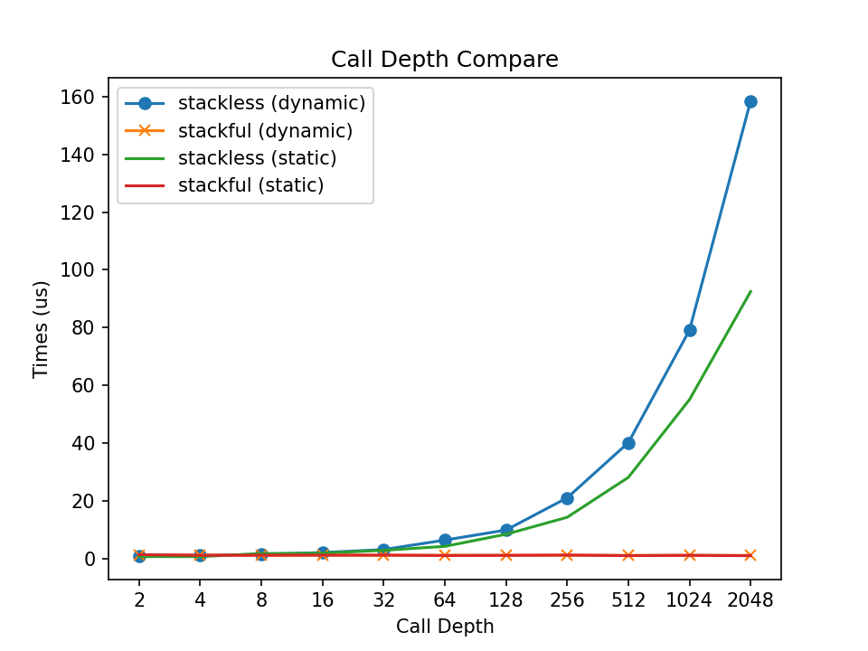
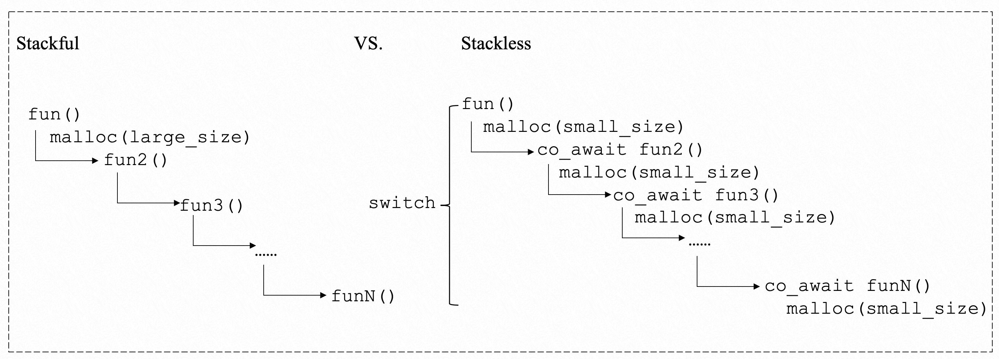

## 前言

在异步化的风潮下，越来越多的开发者开始关注协程，与协程有关讨论也越来越热烈。协程，从实现上，可以分为有栈协程和无栈协程。Golang等语言实现的是有栈协程，C#等语言实现的是无栈协程。在经过多年的讨论后，C++20标准终于给开发者带来了协程的标准和机制。C++20的协程采用的是无栈协程。C++20协程的介绍相关的文章比较多，比如[https://lewissbaker.github.io](https://lewissbaker.github.io)
系列、 [https://blog.panicsoftware.com/coroutines-introduction/](https://blog.panicsoftware.com/coroutines-introduction/)
系列。但是，关于C++协程性能的文章还比较少，且大多为定性分析。本文以Alibaba开源的协程库[async_simple](https://github.com/alibaba/async_simple)
为基础，以该库内部实现的无栈协程Lazy和有栈协程Uthread为参考实现，定量分析不同场景下协程的性能。通过不同的测试用例，定量分析协程的性能，本文的结论如下：

- 无栈的切换速度要远高于有栈。
- 无栈协程更加适合IO场景。
- 无栈协程相比普通函数会有额外开销。

## 特别说明

本文中的无栈协程特指async_simple中的Lazy实现。

本文中的有栈协程特指async_simple中的uthread实现。

## 测试环境

async_simple版本：2db1337d32931914d80aa874a140dc1a21272b94
测试套件：Google Benchmark
测试机器：Workstation/32C
CPU: Intel(R) Xeon(R) CPU E5-2650 v2 @ 2.60GHz

## 测试结果与分析

测试用例见[benchmark](../../benchmarks)。

### 语言角度的切换

通过构造协程纯切换的场景，尽可能排除其他影响因素，比较协程切换速度。

从图中可以看到，不管是有栈还是无栈，耗时都是随着切换次数线性增长，说明切换为主要开销，其他影响因素为次要开销，可以忽略。在数值上，相同切换次数下，有栈的耗时大约是无栈的100倍。百万量级的切换，无栈耗时为0.4ms，而有栈高达40ms，说明无栈的切换速度是远高于有栈的。对于这样的差距，主要是因为在实现层面，有栈的切换需要修改大量的寄存器，而无栈的切换仅需要修改少数的寄存器。
⚠️：

- 协程中的内存分配，有栈需要提前分配一大块内存给调用栈，无栈需要给协程帧分配内存。
- 为了排除内存分配的影响，也做了内存提前分配（通过静态char数组实现），测试结果没有明显差异。
- 为了验证无栈循环内的仍然有协程强制切换代码，也测试了空循环，测试结果空循环耗时为0ms。
- async_simple没有直接提供开箱即用的Generator，本case中的Generator是重写的一个简单实现。
- 用户感知到的切换，还与调度器等有关。

### IO密集型任务

测试不同的IO对性能的影响

读不同大小的文件，每个任务只读一个文件，读完文件所有内容，使用相同libaio库。
每次测试时任务数目相同，读取的文件大小不同。

并行读多个文件，每个文件大小4KiB。
每次测试时，读取的文件大小相同，任务数目不同。

第一个case只是单纯的读一次文件，没有其他的函数调用或者深层的函数调用。
整个过程中无栈的耗时均小于有栈的。

第二个case是相同的IO任务，均使用libaio库同时读多个相同文件（文件大小为4KB），但任务的数目不同。从图中可以明显看出，在大量IO并发进行时，无栈的性能好于有栈。在具体数值上，1千个读取任务，有栈耗时300+s，无栈耗时70+s，有栈的耗时约为无栈的4倍。
这说明在IO场景下，无栈相较于有栈更具有优势。

⚠️：

- 在实际的使用中，一般不会在最顶层直接做IO操作（比如读文件），往往在一系列函数调用后，才会做IO操作。

### 函数调用深度

测试函数调用深度对性能的影响

在只有一次IO的场景中，随着函数调用深度的增加，无栈协程的性能慢慢下降，而有栈协程的表现则比较稳定。
为了排除异常的影响，给全链路加了noexcept，测试结果如图。加了noexcept，耗时轻微降低，不影响整体趋势，说明还会有其他的因素影响到无栈的性能。

为了排除内存分配的影响，也做了通过静态分配进行提前分配内存的测试，测试结果如图。去掉内存分配的开销，可以显著降低无栈的耗时。但是，从图中可以明显看出，除开内存分配的开销（蓝色线到绿色线），无栈的耗时仍然高于有栈，说明还有其他的因素增加了调用无栈协程函数的开销。

从内存分配角度看。在不考虑编译器优化的情况下，有栈协程一次性分配一块大的内存，而无栈每次分配一小块内存。无栈协程随着内存分配次数增加，达到某个阈值，累计的开销就会超过有栈协程一次分配的开销。
即便考虑编译器对无栈协程堆分配的优化，编译器也无法完全消除堆内存分配，依然会存在某个阈值。
除内存分配开销外，还有其他的开销。因此，可以用下面的公式表示：

$$
\text{overheadOfSwitch} + \sum_i^N (\text{overheadOfSmall}_i + \text{overheadOfOthers}_i) > \text{overheadOfLarge}
$$
其中，$\text{overheadOfSwitch}$是切换开销，$\text{overheadOfSmall}_i$是第$i$次分配小内存的开销，$\text{overheadOfOthers}_
i$是第$i$次其他的开销，$\text{overheadOfLarge}$是分配一次大内存的开销。

总的来说，协程函数的调用相较于普通函数的调用来说，还会有额外开销。

⚠️：

- 到底还有哪些其他的开销，限于时间原因，还未完全弄清楚，需要未来继续探索。对这方面感兴趣的同学，欢迎讨论。

## 小结

- 无栈的切换速度要远高于有栈。
- 无栈协程更加适合IO场景。
- 无栈协程相比普通函数会有额外开销。

async_simple中提出了一种混合协程的概念，即在请求的前半部分(有比较深的函数调用)通过有栈协程处理，后半部分(IO)
通过无栈协程处理，可以同时兼顾有栈无栈的优势。

本文使用的测试用例都是极度简化的，真实的业务比这些要复杂太多。真实的业务进行异步化改造具体是采用哪种协程以及如何编写该协程的最佳实践代码，仍需要多尝试，多测试，具体问题具体分析。
感谢阅读到这里，希望本文对你有帮助。
