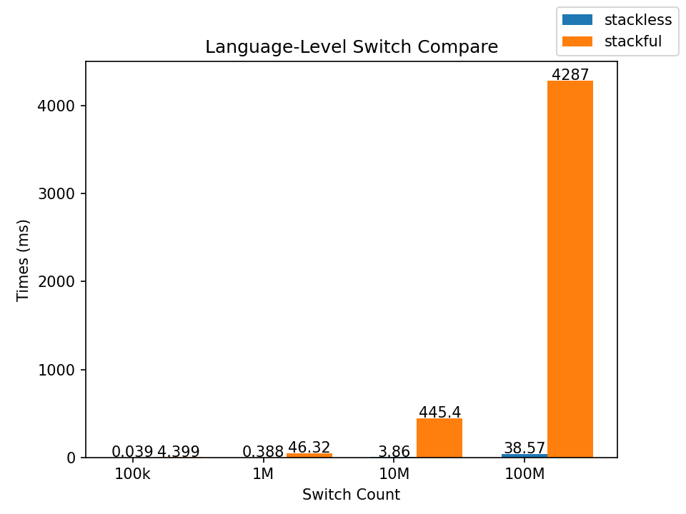

## Introduction

Under the trend of asynchronization, more and more developers have begun to pay attention to Coroutine.
Coroutine can be divided into stackful coroutine (e.g. Golang) and stackless coroutine (e.g. C#).
The C++20 standard brings coroutine mechanism to developers.

In this artice, we conduct experiments base on Alibaba open source library
[async_simple](https://github.com/alibaba/async_simple).

The conclusions are as follows

- The switching speed of stackless coroutine is much higher than that of stackful coroutine.
- The stackless coroutine is more suitable for IO scenarios.
- The stackless coroutine has additional overhead compared to ordinary function.

## Disclaimer

- stackless coroutine: Lazy in async_simple

- stackful coroutine:  Uthread in async_simple

## Environment

- async_simple version: 2db1337d32931914d80aa874a140dc1a21272b94
- test suit: Google Benchmark
- machine: Workstation/32C
- CPU: Intel(R) Xeon(R) CPU E5-2650 v2 @ 2.60GHz

## Result && Analysis

test cases in [benchamrk](../../benchmarks)

### Language-Level Switch

Exclude other factors as much as possible,
and compare the speed of coroutine switching.

As can be seen from the figure, the time-consuming increases linearly with the number of switching.
Under the same number of switching, the time-consuming of stackful coroutine is about 100 times that of stackless coroutine.
We attribute this to the fact that switching of stackful coroutine requires modifying many more registers than stackless coroutine.

⚠️：

- About memory allocation.
The stackful coroutine need to allocate a large amount of memory in advance,
while the stackless coroutine need to allocate memory for coroutine frame.

- Excluding the effect of memory allocation, there is no significant difference in test results.

- Additional experiments show that stackless coroutines do the switch.

- async_smple has no Generator. The Generator is written from scratch.

- The switch perceived by the user is also related to the scheduler and so on.

### IO Intensive Tasks

use libaio to read file.

case 1: The number of tasks is the same in each test, and the file size read is different.

case 2: In each test, the file size read is the same, and the number of tasks is different.

For case 1, the time-consuming of stackless coroutine is less than that of stackful coroutine in the whole process.

For case 2, the performance of stackless coroutine is better than that of stackful coroutine.

⚠️：

- The IO operations are often performed after a series of function calls in real scenarios.

### Function Call Depth

test how function call depth affect corouine performance

As the depth of function calls increases,
the performance of stackless coroutine slowly declines,
while the performance of stackful coroutine is relatively stable.

In order to exclude the influence of exceptions,
`noexcept` is added to the call chain.
Adding `noexcept` reduces the time consumption slightly,
but does not affect the overall trend,
indicating that there are other factors that affect the stackless coroutine performance.

We also conduct experiments without memory allocation.
Removing the overhead of memory allocation can significantly reduce the time-consuming of stackless coroutine.
The time-consuming of stackless coroutines is still higher than that of stackful corotuine,
indicating that there are other factors that increase the overhead of stackless coroutine.

From the memory allocation perspective,
if we don't consider compiler optimization,
stackful coroutine allocates a large chunk of memory advance,
while the stackless coroutine allocates a small chunk of memory for each coroutine frame.
As the number of memory allocations for stackless coroutine increases,
the accumulated overhead will exceed the overhead of stackless coroutine.
Even if the compiler's optimization is considered,
the compiler cannot completely eliminate heap memory allocation,
and there will still be a certain threshold.
In addition to memory allocation overhead, there are other overheads.
Therefore, it can be expressed by the following formula

$$
\text{overheadOfSwitch} + \sum_i^N (\text{overheadOfSmall}_i + \text{overheadOfOthers}_i) > \text{overheadOfLarge}
$$

In general, the call of the coroutine function will have additional overhead compared to the call of the ordinary function.

## Conclusion

- The switching speed of stackless coroutine is much higher than that of stackful coroutine.
- The stackless coroutine is more suitable for IO scenarios.
- The stackless coroutine has additional overhead compared to ordinary function.

async_simple designed hybrid coroutine in practice.
Hybrid coroutine allows a query runs in both stackful coroutine and stackless coroutine
so that the codes could get the benefit from both.

see [Hybrid Coroutine](HybridCoro.md) for details.
